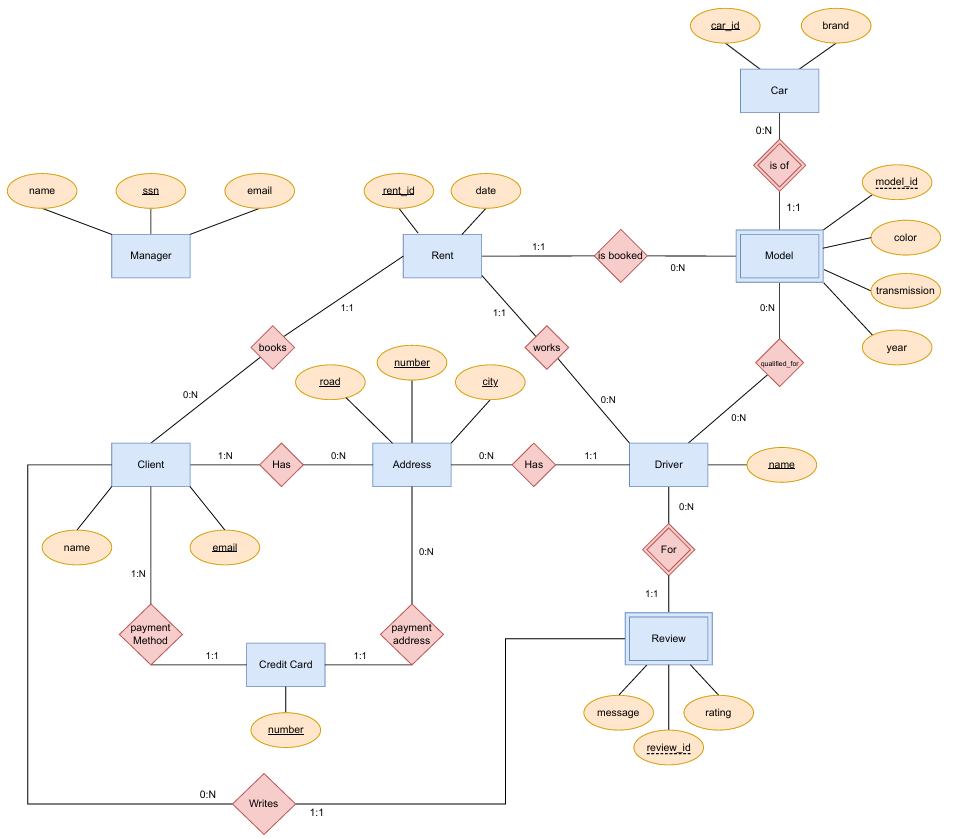

# Taxi Service Management System

**A layered Python application and PostgreSQL database for managing a multi-role taxi service, featuring complex relational mapping and role-based access control.**

_Developed for CS 480: Database Systems at UIC._ **Authors:** Kevin Jara,
Isaiah Martil, Michael Ruch

---

###  Overview

This system provides a complete end-to-end backend solution for a taxi service, handling everything from client registrations and vehicle rentals to driver reviews and manager-level analytics. The project emphasizes data integrity, relational mapping of weak entities, and a modular software architecture that separates database operations from user-facing logic.

---

###  System Architecture

The application follows a **Data Access Layer (DAL)** pattern to ensure a clean separation of concerns:

- **`main.py`**: The entry point that manages the connection lifecycle and orchestrates the primary control flow.
    
- **User Modules (`client.py`, `driver.py`, `manager.py`)**: Implements Role-Based Access Control (RBAC). Each module contains logic exclusive to that user type, ensuring managers can perform administrative tasks that are restricted from clients and drivers.
    
- **`dbTier.py`**: A dedicated Data Access Layer. Every function is stateless, accepting a `psycopg2` connection and parameters to execute targeted SQL queries. This prevents database logic from "leaking" into the UI layer.

---

###  User Roles & Access Control

The system implements a multi-tenant architecture where functionality is gated based on the user's role. There are 3 roles in this system:

#### **1. Manager (Administrative Tier)**

- **Access:** Requires login with a SSN verified against the `Manager` table.
    
- **Fleet Management:** Full CRUD (Create, Read, Update, Delete) permissions for Taxis and Drivers. Deleting a brand automatically triggers a cascading delete of all associated models.
    
- **System Analytics:** Access to the full administrative analytics suite, including top-client rankings, driver analytics, and cross-city service analysis.

#### **2. Client (Service Tier)**

- **Access:** Requires login with an email verified against the `Client` table.

- **Account Management:** Register accounts and manage multiple service addresses (mapped via `ClientAddresses`).
    
- **Intelligent Booking:** A search-and-book flow that identifies available models and drivers by specific dates.
    
- **Verified Reviews:** Implements a logical constraint where clients may only review drivers with whom they have a verified rental history.
    

#### **3. Driver (Operations Tier)**

- **Access:** Requires login with a unique name verified against the `Driver` table.

- **Status Management:** Update address data and qualifications.
    
- **Qualification Mapping:** Allows drivers to declare proficiency for specific vehicle models, updating the `Drives` junction table.
    

<details> <summary><b>▶ View Command-Line Interface (CLI) Menus</b></summary>

**Manager Main Menu**


```Plaintext
1. Manage Cars                4. List car information
2. Manage Drivers             5. List driver information
3. List top clients           6. Client/Driver city search
Enter a command (1-6, or x to log out): 
```

**Client Menu**


```Plaintext
1. Add address                4. Book a rent
2. Add credit card            5. View my rents
3. Search models by date      6. Post a review
Enter a command (1-6, or x to log out): 
```

**Driver Menu**


```Plaintext
1. Change my address          
2. List all car models
3. Declare I can drive a model
Enter a command (1-3, or x to log out): 
```

</details>

---

###  Database Design Highlights

The schema was designed using formal Entity-Relationship (ER) modeling principles to ensure 3rd Normal Form (3NF) compliance.

<p align="center">  </p>

- **Complex Mapping:** Utilized junction tables (`ClientAddresses`, `Drives`) to handle many-to-many relationships and foreign key injections for one-to-many associations.
    
- **Weak Entity Management:** Correctly modeled `Model` (dependent on `Car`) and `Review` (dependent on `Driver`) using composite primary keys and `ON DELETE CASCADE` constraints to maintain referential integrity.
    
- **Data Integrity:** Implemented `CHAR` constraints for fixed-length identifiers (SSNs, CC numbers) and normalized hierarchical data (Addresses) across multiple tables to minimize redundancy.
    

---

###  Key Implementation Details and Examples

#### **Administrative Analytics**

The system provides managers with actionable insights using complex PostgreSQL aggregations:

- **Customer Loyalty Tracking:** Implements a Top-K Ranking algorithm to identify high-value clients based on total rental volume.

        
- **Cross-City Logistics Analysis:** A complex four-table join (`Client`, `ClientAddresses`, `Rent`, `Driver`) that identifies behavioral patterns between client residential hubs and driver service areas. This demonstrates the ability to filter through deep relational hierarchies.

- **Driver Performance:** Joins `Rent` and `Review` tables while using `COALESCE` to handle new drivers with no current rating (exampled below):


```SQL
SELECT d.name,
       COUNT(r.rent_id) AS total_rents,
       COALESCE(ROUND(AVG(rv.rating)::numeric, 2), -1) AS avg_rating
FROM Driver d
LEFT JOIN Rent r ON d.name = r.driver
LEFT JOIN Review rv ON d.name = rv.driver
GROUP BY d.name
ORDER BY d.name;
```

#### **Transactional Integrity (`dbTier.py`)**

This following example demonstrates the standardized pattern followed in the data access tier used to ensure atomicity and leak prevention during database inserts:


```Python
def insert_client(conn, email, name, commit=True):
    """
    Inserts a new client into the database with conflict handling and 
    transactional integrity.
    """
    is_successful = False
    dbQuery = """INSERT INTO Client (email, name)
                 VALUES(%s, %s) 
                 ON CONFLICT (email)
                 DO NOTHING
                 RETURNING 1"""
    curr = conn.cursor()
    try:
        curr.execute(dbQuery, (email, name))
        if commit:
            conn.commit()
        # If RETURNING 1 gave us a result, the insertion was new
        if curr.fetchone() is not None:
            is_successful = True
    except Exception as e:
        print("\nDatabase Error: ", e)
        conn.rollback() # Ensure atomicity
    finally:
        curr.close() # Prevent connection leaks
    return is_successful
```

---

### Implementation Notes & Security

To facilitate demonstration and academic evaluation, certain architectural simplifications were made that would be expanded in a production environment:

- **Demonstration Authentication:** The entry menu allows for rapid manager profile creation, but production systems would use a secure administrative bootstrap. 
    
- **Primary Identifiers:** Uses `Name` for Driver identification; however, a scalable system would utilize unique `UUIDs` or `Employee_IDs`.
    
- **Security Layering:** While roles are enforced at the application level, production systems would implement Row-Level Security (RLS) and salted/hashed password storage for login info.

- **Configuration Management:** The system utilizes a file called `dbinfo.txt` to store connection parameters, allowing the application to be portable across different local PostgreSQL environments.
    
- **Security Disclosure:** To maintain credential hygiene, the repository includes an example file `dbinfo_example.txt` populated with dummy placeholder data. In a production scenario, these credentials would be stored in encrypted environment variables to prevent unauthorized access or accidental exposure via version control.
    
- **SQL Injection Prevention:** All database interactions in `dbTier.py` use parameterized queries (via `%s` placeholders) to sanitize user input and protect the system against SQL injection attacks.
    

---

### Technical Stack

- **Backend:** Python 3.x
    
- **Database:** PostgreSQL
    
- **Library:** psycopg2
    
- **Concepts:** 3rd Normal Form (3NF), RBAC, Relational Mapping, ACID Compliance.
    

---

###  How to Run

- **Prerequisites:** Ensure you have Python 3.8+ and a PostgreSQL server installed.
    
- **Dependencies:** Install the necessary adapter: `pip install psycopg2-binary`.
    
- **Database Configuration:** C

    * Locate `dbinfo_example.txt` in the root directory.

    * Create a new file named `dbinfo.txt`, copy the contents of the example file into it, and replace placeholder info with your local credentials.

    * Note: dbinfo.txt is specifically ignored by Git to ensure your local credentials are never accidentally committed to the repository.
        
- **Database Setup:** Execute the provided `create_tables.sql` script in your PostgreSQL tool (like pgAdmin or psql) to build the required tables and relationships. Basic test data is also provided in `test_info.sql` to with enough test data to easily test every feature.
    
- **Launch:** Run `python main.py` and select "Register Manager" from the initial menu to set up your first administrative account (or login as the sample manager provided in the test info file).